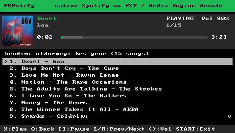
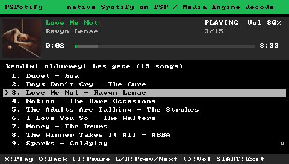
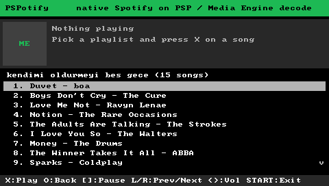

# PSPotify ME

> **Work in progress.** It plays full Spotify tracks on real hardware, but expect rough edges, missing features and the occasional hang. See [Status](#status).

A native Spotify client for the PlayStation Portable. Everything runs on the PSP itself — no PC, phone app or proxy in the loop. The second CPU, the **Media Engine**, decodes the music while the main CPU handles the network and the UI.

- Signs in once by pairing at **spotify.com/pair** (like a smart TV), then refreshes silently.
- Browses **Liked Songs** and your **playlists**, with album covers.
- Streams and plays **full tracks** (Ogg Vorbis 160 kbps), with a queue that moves on to the next song by itself.
- **TLS 1.2** on the PSP through a bundled BearSSL: the firmware's SSL stops at TLS 1.0, and every Spotify endpoint requires TLS 1.2.
- **Ogg Vorbis decoded on the Media Engine**: while the Media Engine decodes frame N+1, the main CPU plays frame N.

Requires **Spotify Premium**.

<p align="center">
  
  
</p>
<p align="center">
  
</p>

<sub>Real PSP-3000 screenshots (480×272).</sub>

## Requirements

| | |
|---|---|
| Console | PSP-3000 family (tested on a PSP-3000) |
| Firmware | 6.61 with ARK CFW. The Media Engine bring-up refuses any other firmware. |
| Network | A Wi-Fi profile saved in the PSP's network settings |
| Account | Spotify Premium |

## Install

1. Download the latest `PSPotify-ME` build artifact (from Actions or Releases) and copy its `PSP` folder to the root of the Memory Stick. You should end up with `ms0:/PSP/GAME/PSPOTIFY/EBOOT.PBP`.
2. Launch **PSPotify ME** from *Game → Memory Stick*.
3. On the first start the PSP shows a six-letter code. Open **spotify.com/pair** on a phone or computer, sign in and enter the code. The approval page names the client "Spotify for Desktop"; that is expected.
4. Your library appears. Later starts skip pairing.

More detail, plus troubleshooting, is in [docs/SETUP.md](docs/SETUP.md).

## Controls

| Button | Action |
|---|---|
| ↑ / ↓ | Move (hold to scroll) |
| ✕ | Open playlist / play song |
| ○ | Back to the library |
| □ | Pause / resume |
| L / R | Previous (restart after 3 s) / next song |
| ← / → | Volume |
| START | Quit |

## How it works

```
                        main CPU (Allegrex, 333 MHz)                         Media Engine
 ┌────────────────────────────────────────────────────────────────────┐   ┌───────────────┐
 │ UI thread       library + covers ── spclient / i.scdn.co (TLS 1.2) │   │               │
 │ player thread   metadata → audio key (AP) → storage-resolve        │   │  stb_vorbis   │
 │ fetch thread    CDN download → AES-128-CTR decrypt → RAM buffer ───┼──►│  frame decode │
 │ keepalive       AP pings, next-track prefetch                      │   │  → s16 PCM    │
 │ audio out       PCM ring ◄─────────────────────────────────────────┼───┤               │
 └────────────────────────────────────────────────────────────────────┘   └───────────────┘
```

1. **Sign-in.** The PSP pairs once through Spotify's OAuth device flow and keeps the refresh token. The access token logs in to Spotify's access point (Shannon-encrypted, Diffie-Hellman handshake). The access point returns reusable credentials. Those credentials get a login5 Bearer token for Spotify's internal services.
2. **Library.** Playlists come from the rootlist service and Liked Songs from the collection service. Track names, artists, durations and covers come from batched extended-metadata requests.
3. **Playback.** For each track the player:
   - picks the Ogg Vorbis 160 kbps file,
   - requests its AES key over the access point,
   - resolves a CDN URL,
   - downloads the file on a background thread, decrypting each chunk as it arrives.

   The next track is resolved ahead of time.
4. **Decoding.** Each Vorbis frame is handed to the Media Engine through mcidclan's safe-task dispatcher. A small assembly trampoline gives the task its own stack and enables the FPU. The Media Engine writes s16 PCM back to shared memory, and the main CPU queues it to the audio hardware. A build check fails if any code that runs on the Media Engine uses `syscall` or `$gp`.

[docs/IMPLEMENTATION.md](docs/IMPLEMENTATION.md) covers the Media Engine protocol and its cache rules.

## Status

Works on hardware: pairing, library browsing, covers, full-track playback with Media Engine decoding, the queue, pause, next/previous and volume.

Known limitations:
- **Memory:** the whole track is buffered in RAM, which allows about 15 minutes at 160 kbps.
- **Missing features:** no search, seeking or shuffle.
- **Library limits:** up to 100 playlists and 500 tracks per list.
- **Text:** the font is ASCII. Accented Latin letters are shown without their accents, and other scripts show `?`.
- **Errors:** a track that fails to resolve is skipped. After three failures in a row playback stops.
- **Long sessions:** sessions longer than an hour, which need token renewal, have had little testing.

Everything is logged to `spotify.log` next to the EBOOT. Bug reports with that file attached are very welcome.

## Building

The build needs PSPDEV, Python 3.8+, CMake and Git. With `PSPDEV` set:

```sh
python3 scripts/build.py
```

The build script:
- fetches the pinned dependencies into `.deps/` (Media Engine custom core and safe task, BearSSL, stb),
- builds the EBOOT,
- runs the static checks in `scripts/verify_artifacts.py`,
- puts the installable layout in `dist/`.

GitHub Actions does the same on every push, using the `pspdev/pspdev` container.

## Layout

| Path | Contents |
|---|---|
| `main.c`, `me_loop.c` | Media Engine bring-up, network start, teardown |
| `spotify/session.c` | Sign-in, tokens, access point keepalive, track resolution and prefetch |
| `spotify/player.c`, `me_vorbis.c`, `me_trampoline.S` | Download, decryption and the Media Engine decode pipeline |
| `spotify/ui.c`, `gfx.c` | Interface and framebuffer drawing |
| `spotify/webapi.c` | clienttoken, login5, OAuth, metadata, storage-resolve, library |
| `spotify/handshake.c`, `login.c`, `shannon.c`, `dh.c`, `audiokey.c` | Access point protocol |
| `spotify/http.c`, `tls.c`, `trust_anchors.h` | HTTP/1.1 client and TLS 1.2 (BearSSL) |
| `certs/`, `scripts/gen_trust_anchors.py` | Bundled root certificates and the generator |

## Security notes

- `spotify.cfg` holds a refresh token and reusable credentials in plain text. Anyone with the Memory Stick can use your account. To revoke access, remove "Spotify for Desktop" under *Account → Apps* on spotify.com.
- Server certificates are verified against the bundled roots. The PSP clock must be roughly correct.

## Credits

- [mcidclan](https://github.com/mcidclan): [psp-media-engine-custom-core](https://github.com/mcidclan/psp-media-engine-custom-core) and [psp-media-engine-safe-task](https://github.com/mcidclan/psp-media-engine-safe-task) (MIT). They make running code on the Media Engine possible.
- [BearSSL](https://www.bearssl.org/) by Thomas Pornin (MIT).
- [stb_vorbis and stb_image](https://github.com/nothings/stb) by Sean Barrett (public domain / MIT).
- [librespot](https://github.com/librespot-org/librespot): the reference for Spotify's protocols.
- The UI layout and font come from my earlier [PSPotify](https://github.com/Agalar-Development/PSPotify) MP3 player.

Third-party license texts are in [`licenses/`](licenses).

## Disclaimer

This is an unofficial hobby project. It is not affiliated with, endorsed by or supported by Spotify. It talks to Spotify's private services, which can change or block it at any time. It does not save or export audio. Use it at your own risk and in line with Spotify's terms.
